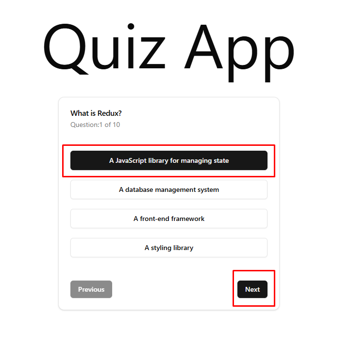
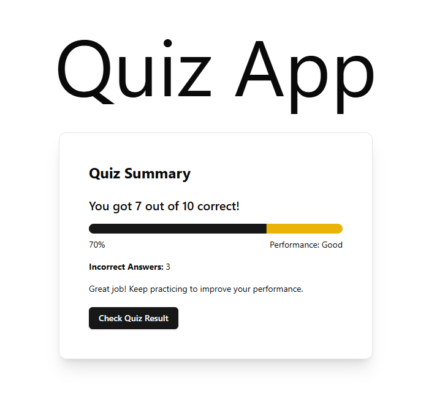
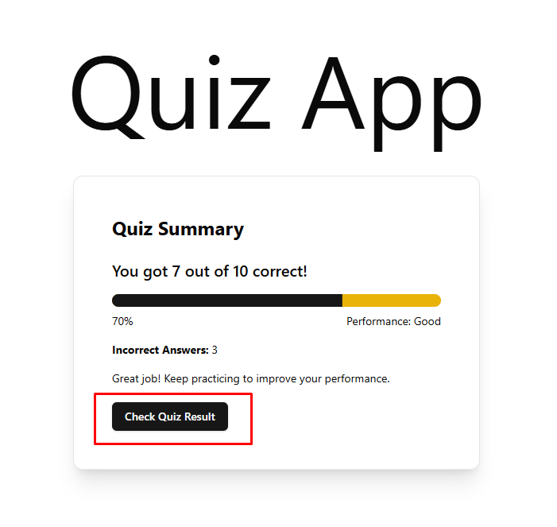
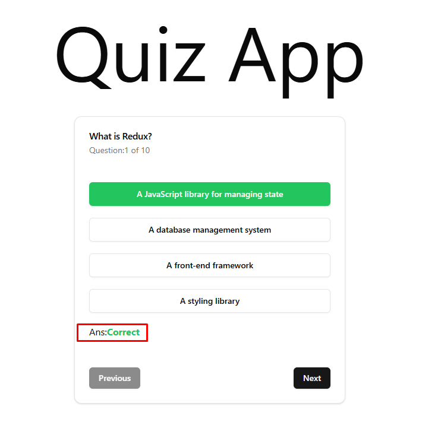

# React Quiz Application
[Live Link](https://redux-quiz-app-mocha.vercel.app/)

### **Overview:**

The "Redux Quiz App" allows users to answer quiz questions with a user-friendly interface. It uses Redux for state management, providing a dynamic and responsive experience. Key features include tracking user progress, real-time feedback, and a score summary at the end of the quiz

* * *

  

## Technologies

*   **Vite**
*   **TypeScript**
*   **Redux**
*   **Shadcn**

* * *

### **Locally Project Setup:**

```
git clone https://github.com/mdrakibmia99/quiz-app.git
cd quiz-app
npm install
```
---
### **create .env in root file:**
```
VITE_REACT_APP_SERVER_URI=YOUR_SERVER_URI

```
---


#### Run Project:
```
npm run dev 
```

## Features and Requirements
 
 #### complete all quiz step by step


#### User will see his/her result after completing the quiz


#### if you want to see the result information just click the check Quiz Result button


#### Result
